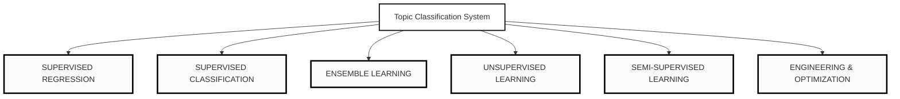

# Enterprise-Grade Implementation Roadmap: Machine Learning Educational Platform
**Target Path**: `content/artificial-intelligence/02-machine-learning`

This document outlines the complete architectural specification and systematic deployment plan for building all 27 highly interactive, high-density machine learning educational modules. Each module is designed as an interactive chapter blending deep mathematical theory, real-time visualization, synchronized live code execution, and empirical failure-mode exploration.

---

## Technical Stack & Constraints
- **Framework**: Next.js 15 (App Router, React Server Components where applicable, Client-Side Simulations)
- **State Management**: Zustand (isolated transient state per lesson page, zero global pollution)
- **Styling**: Tailwind CSS v4, Vanilla CSS variables, high-contrast monochrome design token systems
- **Math Rendering**: KaTeX (via unified/remark plugins or specialized light client wrappers)
- **Code Playground**: Monaco Editor (optimized, single-instance web worker context)
- **Visualization Suite**: D3.js (Canvas & SVG hybrid), React Flow (for pipeline/tree nodes), Framer Motion (for UI transitions)
- **Accessibility**: WCAG 2.1 AA compliant, screen-reader compatible math labels, keyboard-navigable interactive controls
- **Aesthetic**: High-contrast black-and-white theme, premium typography, sharp borders, and subtle global spotlight integration

---

## Phase 1: Foundation Architecture

### Project Initialization & Repository Strategy
- **File Structure**: Core lessons are dynamically crawled from `content/artificial-intelligence/02-machine-learning/[lesson].tsx`.
- **RSC vs. Client Components**: 
  - Every lesson page acts as a Next.js Client Component (`"use client"`) due to the heavy reliance on synchronized state, Monaco editor, and D3 animation loops.
  - Page wrapper templates are compiled statically, while content and code assets are lazy-loaded on navigation.
- **TypeScript Architecture**:
  - `lib/types/ml-platform.ts` defines core contracts for states, parameter schemas, code steps, and dataset structures.
  - All dataset matrices must be explicitly typed as `number[][]` or typed multi-dimensional arrays, preventing runtime numerical errors.

### Theme & Global Registry Integration
- **Registry Update**: `lib/content-registry.ts` is the single source of truth. All 27 lesson IDs are registered in `LESSON_ORDER` under the `"machine-learning"` topic block.
- **Routing**: The routing engine maps `/learn/artificial-intelligence/machine-learning/[lesson]` dynamically using the filesystem-based generator (`npm run generate:lesson-loaders`).
- **Loaders**: `SimulationSkeleton` is implemented using monochrome SVG shimmering to prevent layout shifts during Monaco or D3 script initialization.

---

## Phase 2: Global Design System

The platform enforces a high-contrast monochrome aesthetic, utilizing defined design tokens from `app/styles/theme.css`.

### Core CSS Variable System
```css
:root {
  --bg-primary: #ffffff;
  --bg-secondary: #f5f5f5;
  --bg-tertiary: #fafafa;
  --text-primary: #000000;
  --text-secondary: #555555;
  --text-tertiary: #888888;
  --border-primary: #000000;
  --border-secondary: #e0e0e0;
  --border-focus: #000000;
  --glow-light: rgba(0, 0, 0, 0.05);
  --selection-bg: #000000;
  --selection-text: #ffffff;
  --font-mono: "Geist Mono", SFMono-Regular, Consolas, monospace;
}

@media (prefers-color-scheme: dark) {
  :root {
    --bg-primary: #000000;
    --bg-secondary: #111111;
    --bg-tertiary: #0a0a0a;
    --text-primary: #ffffff;
    --text-secondary: #aaaaaa;
    --text-tertiary: #666666;
    --border-primary: #ffffff;
    --border-secondary: #222222;
    --border-focus: #ffffff;
    --glow-light: rgba(255, 255, 255, 0.08);
  }
}
```

### Typography, Layout & Standard Spacing
- **Padding**: Standard high-density layout utilizes a container wrapper with `px-12 py-24`.
- **Borders & Shadows**: High-contrast, sharp solid borders (`border-1 border-[var(--border-primary)]`) replace soft, multi-colored modern gradients.
- **Card Primitives**:
  - `EducationalCard`: Standardized container with clear header, body, and high-contrast action indicators.
  - `FormulaBlock`: Monospaced, vertically padded math containers utilizing KaTeX for exact math representation.
  - `CodePanel`: Standard container featuring a top utility bar with control actions (Read, Step, Edit) and Monaco wrapper.
  - `VisualContainer`: Fully responsive layout bounding box maintaining a precise aspect ratio, housing Canvas/SVG elements.

---

## Phase 3: Educational Page Engine

To maintain visual consistency across all 27 chapters, pages are constructed using a modular, highly configurable schema. Each page maps to a standard component layout:

```
+--------------------------------------------------------+
|                      Page Header                       |
|               [Subject] / [Topic] / [Lesson]           |
+--------------------------------------------------------+
|                                                        |
|  +------------------------+  +----------------------+  |
|  |                        |  |                      |  |
|  |                        |  |      Theory &        |  |
|  |      Interactive       |  |      Formula         |  |
|  |     Visualization      |  |      Details         |  |
|  |      (D3 / Canvas)     |  |       (KaTeX)        |  |
|  |                        |  |                      |  |
|  +------------------------+  +----------------------+  |
|                                                        |
|  +------------------------+  +----------------------+  |
|  |                        |  |                      |  |
|  |     Monaco Editor      |  |      Parameters      |  |
|  |   Playground (Code)    |  |     Controls Panel   |  |
|  |                        |  |                      |  |
|  +------------------------+  +----------------------+  |
|                                                        |
+--------------------------------------------------------+
```

### Modular Sections Definition
1. **Theory Block**: Technical exposition formatted via structured markdown with custom elements. No generic prose; explanations are mathematically precise.
2. **Formula Block**: Central mathematical formulation displaying standard equations, supporting hover annotations that highlight matching variables in the active D3 visualization.
3. **Visual Intuition Canvas**: Immersive playground with preloaded synthetic datasets (e.g., clustered points, moons, linear distributions).
4. **Synchronized Code Panel**: Interactive, non-blocking execution environment mapping active code structures to visualization states.
5. **Parameter Controller Panel**: Clean sliders and toggles bound directly to the visual mathematical models, allowing immediate state changes.
6. **Failure Mode Simulator**: Dedicated diagnostic control allowing students to intentionally trigger critical failures (e.g., high learning rate divergence, extreme underfitting/overfitting, multi-collinearity).
7. **Applications & Engineering Realities**: Deep technical discussions about real-world failure patterns, resource bottlenecks, and mitigation strategies (e.g., custom CUDA kernels, memory swapping).

---

## Phase 4: Topic Classification System

The 27 lessons are systematically organized under four major subject groups. The runtime rendering engine adapts dynamically according to the complexity of the category:



### Engine Adaptations by Category:
- **Regression**: Optimized for Continuous Coordinate Projection. Focuses on high-frequency coordinate translations, 2D line projections, error residual plotting, and dynamic cost landscape gradients.
- **Classification**: Boundary Mapping Mode. Leverages high-performance HTML5 Canvas pixel classification rendering to display multi-class decision boundaries in real time without lagging the main browser thread.
- **Ensemble**: Structural Tree Rendering. Dynamic SVG hierarchy engines visualizing complex tree architectures, sequential boosting residual adjustments, and stacking pipelines.
- **Unsupervised**: Dynamic Trajectory Tracking. Tracks optimization vectors (centroids moving in K-Means, density propagation paths in DBSCAN, principal axes rotating in PCA) using D3 transition loops.
- **Semi-Supervised**: Node Graph Traversal. Utilizes customized React Flow graphs to visualize label propagation, showing the progressive coloring of unlabeled nodes based on graph similarity weights.
- **Engineering & Optimization**: Architectural Pipeline Diagrams. Dynamic state charts that display sequential operations (scaling, cross-validation splits, hyperparameter optimization tables).

---

## Phase 5: Synchronized Learning System

The core feature of the platform is a unified, bi-directional state synchronization engine. Every UI component reacts immediately to changes initiated by other components.

```
       +--------------------------------------------+
       |           Zustand State Store              |
       |  - Dataset: { x: number, y: number }[]     |
       |  - Parameters: { learningRate, epochs }    |
       |  - ActiveStep: number                      |
       |  - ExecutionLine: number                   |
       |  - ModelWeights: number[]                  |
       +--------------------------------------------+
            /            |                \
           /             |                 \
          v              v                  v
    [D3 Canvas]   [Monaco Editor]    [KaTeX Formulas]
    Render dots   Highlight line     Update dynamic numerical
    & projections  & values          coefficients inside LaTeX
```

### Event-Driven Orchestration Architecture
- **State Store**: A dedicated Zustand hook created dynamically per lesson instance (`useLessonStore`).
- **Pacing & Animation Engine**:
  - Animations are scheduled via standard `requestAnimationFrame` loops.
  - Step transitions are controlled through custom timeline objects, allowing students to pause, rewind, or execute steps line-by-line.
  - State changes trigger transient DOM-updates rather than global component re-renders, preventing input lag on slider controls.

---

## Phase 6: Code Execution Engine

The platform integrates a sophisticated local JavaScript execution engine masquerading as a python/interactive interpreter. It supports three distinct operation styles:

### Execution Modes
1. **Read Mode**:
   - Displays clean, production-grade reference implementations of the active algorithm in standard Python.
   - Text annotations align with code blocks using hover-highlights.
2. **Step Mode**:
   - The editor highlights the active line of code in execution.
   - For every line executed, a step tracker updates the model state in the Zustand store, immediately updating the visual chart (e.g., line 5 calculates gradients -> visual updates gradient vector; line 8 adjusts weights -> visual updates line location).
3. **Edit Mode**:
   - Unlocks the Monaco Editor instance. Users can alter variables, adjust conditional boundaries, or override functions.
   - An on-the-fly JavaScript translation engine compiles user edits, validates inputs using a secure sandbox, and regenerates the active simulation loop.

### Monaco Editor Config Spec
- Monochrome theme configurations (`vs-dark` customized for zero-color high-contrast boundaries).
- Minmap disabled, dynamic scrollbars configured, options optimized for screen readers and touch screens.

---

## Phase 7: Visualization Engine

The visualization layer isolates graphics logic to ensure smooth rendering of large datasets without blocking layout calculations.

### Graphics Pipeline Strategy
- **SVG Layer**: Used for structural elements, scales, coordinate axes, interactive selection points, and mathematical annotation vectors.
- **Canvas Layer**: Used for dense coordinate fields, decision boundary contours, dense sample distributions, and multi-class density grids.
- **D3 Zoom & Pan**: Fully implemented across standard visualizations to allow detailed inspection of data points, convergence plots, and outlier boundaries.
- **Framer Motion**: Reserved strictly for high-fidelity UI panel layouts, interactive drawer expansions, and diagnostic notification cards.

---

## Phase 8: Supervised Regression Topics

### 01. Supervised Regression - Linear (`01-supervised-regression-linear.tsx`)
- **Educational Structure**: Transition from simple linear interpolation to empirical Ordinary Least Squares (OLS) minimization.
- **Formulas (KaTeX)**:
  - Hypothesis: $\hat{y} = \theta_0 + \theta_1 x$
  - Loss Function (MSE): $J(\theta_0, \theta_1) = \frac{1}{2m} \sum_{i=1}^m (\hat{y}^{(i)} - y^{(i)})^2$
  - Gradient Update: $\theta_j := \theta_j - \alpha \frac{1}{m} \sum_{i=1}^m (\hat{y}^{(i)} - y^{(i)}) x_j^{(i)}$
- **Visualizations**: D3 coordinate system plotting synthetic data samples with dynamic error residual lines mapping directly to a 3D surface plot representing the OLS cost landscape.
- **Parameter Controls**: Sliders for Learning Rate ($\alpha$), Iterations, Initial $\theta$ values, and Dataset Noise.
- **Failure Case Simulator**: Learning Rate Overload. Setting $\alpha \ge 1.0$ causes weights to rapidly explode, causing the cost projection plane to scale exponentially and the regression line to fly out of bounds.
- **Real-World Engineering Application**: High-frequency system throughput regression models mapping core workloads to thermal throttling curves in container orchestrators.

### 02. Supervised Regression - Polynomial (`02-supervised-regression-polynomial.tsx`)
- **Educational Structure**: Elevate standard linear parameters to multi-degree polynomial space, mapping the structural difference between model capacity, variance, and bias.
- **Formulas (KaTeX)**:
  - Hypothesis: $\hat{y} = \theta_0 + \sum_{k=1}^d \theta_k x^k$
  - Design Matrix formulation: $X = [1, x, x^2, \dots, x^d]$
- **Visualizations**: Dynamic regression curve mapping high-degree polynomial convergence. Users can dynamically add outliers to see the dramatic changes in high-degree curve boundaries.
- **Parameter Controls**: Slider for Degree of Polynomial ($1 \le d \le 12$), Regularization Parameter ($\lambda$), and Dataset Complexity.
- **Failure Case Simulator**: The Overfitting Trap. Setting polynomial degree to 10+ with zero regularization creates a perfect fit for training data, but produces extreme wave oscillations at the outer borders when interpolating out-of-sample vectors.
- **Real-World Engineering Application**: Custom physical system simulation models mapping semiconductor thermal behaviors to varying clock frequencies.

### 03. Supervised Regression - Ridge & Lasso (`03-supervised-regression-ridge-lasso.tsx`)
- **Educational Structure**: Introduce structural penalization parameters to combat high variance and multi-collinearity.
- **Formulas (KaTeX)**:
  - Ridge Loss ($L_2$): $J(\theta) = \frac{1}{2m} \sum_{i=1}^m (\hat{y}^{(i)} - y^{(i)})^2 + \lambda \sum_{j=1}^n \theta_j^2$
  - Lasso Loss ($L_1$): $J(\theta) = \frac{1}{2m} \sum_{i=1}^m (\hat{y}^{(i)} - y^{(i)})^2 + \lambda \sum_{j=1}^n |\theta_j|$
- **Visualizations**: Coordinate projection comparing L1 and L2 penalty spaces. Shows the geometric intersection between OLS contour ellipses and constraint boundaries (circles for Ridge, diamonds for Lasso).
- **Parameter Controls**: Regularization Strength ($\lambda$), Lasso vs. Ridge toggle, and Multicollinear Feature Count.
- **Failure Case Simulator**: Zero-Coefficient Extinction. Increasing Lasso $\lambda$ to extreme thresholds aggressively forces coefficients to absolute zero, causing the fit line to flatten out, illustrating extreme underfitting.
- **Real-World Engineering Application**: Automated feature selection pipelines operating over high-dimensional telemetry feeds in serverless runtime schedulers.

---

## Phase 9: Supervised Classification Topics

### 04. Supervised Classification - Logistic (`04-supervised-classification-logistic.tsx`)
- **Educational Structure**: Introduction to continuous boundary optimization and binary log-likelihood maximum probability optimization.
- **Formulas (KaTeX)**:
  - Sigmoid Function: $\sigma(z) = \frac{1}{1 + e^{-z}}$, where $z = \theta^T x$
  - Cross-Entropy Loss: $J(\theta) = -\frac{1}{m} \sum_{i=1}^m \left[ y^{(i)} \log(\hat{y}^{(i)}) + (1 - y^{(i)}) \log(1 - \hat{y}^{(i)}) \right]$
- **Visualizations**: Split-pane layout. Left panel features classification boundary line dividing 2D point distributions. Right panel features a dynamic Sigmoid S-curve mapping individual points to exact posterior probability heights ($0 \le P(y=1|x) \le 1$).
- **Parameter Controls**: Classification Decision Threshold (default $0.5$), Learning Rate, and Gradient Steps.
- **Failure Case Simulator**: Complete Separability Instability. Feeding a perfectly linearly separable dataset causes OLS coefficients to climb to infinity, triggering numerical overflow errors in sigmoid probability calculations.
- **Real-World Engineering Application**: Dynamic risk scoring engines determining immediate rate-limiting policies for high-throughput API endpoints.

### 05. Supervised Classification - KNN (`05-supervised-classification-knn.tsx`)
- **Educational Structure**: Explore lazy, non-parametric classification logic and the structural influence of localized distance calculations.
- **Formulas (KaTeX)**:
  - Euclidean Distance: $d(p, q) = \sqrt{\sum_{i=1}^n (p_i - q_i)^2}$
  - Minkowski Distance: $d(p, q) = \left( \sum_{i=1}^n |p_i - q_i|^p \right)^{1/p}$
- **Visualizations**: Dynamic 2D canvas with mouse-tracking hover coordinates. As the user moves the cursor across the canvas, D3 projects vectors to the nearest $k$ neighbors, highlighting their classification votes, while the background dynamically redraws the Voronoi boundary cells.
- **Parameter Controls**: Neighbor Count ($K$), Distance Metric (Euclidean, Manhattan, Minkowski), Minkowski Power ($P$).
- **Failure Case Simulator**: The Curse of Dimensionality. Adding noisy, uninformative features to the vector space distorts distance metrics, causing the local classification boundaries to collapse into chaotic, highly unstable regions.
- **Real-World Engineering Application**: Low-latency localized content recommendation networks operating on edge CDN micro-services.

### 06. Supervised Classification - Naive Bayes (`06-supervised-classification-naive-bayes.tsx`)
- **Educational Structure**: Master probability-driven classification founded on the assumption of conditional feature independence.
- **Formulas (KaTeX)**:
  - Bayes Theorem: $P(y | x_1, \dots, x_n) = \frac{P(y) \prod_{i=1}^n P(x_i | y)}{P(x_1, \dots, x_n)}$
  - Posterior formulation with Laplace Smoothing: $P(x_i | y) = \frac{N_{y, i} + \alpha}{N_y + \alpha n}$
- **Visualizations**: 2D scatter plots of distinct feature spaces alongside continuous dynamic Gaussian density overlays showing the computed class conditional probabilities for an interactive test coordinate.
- **Parameter Controls**: Smoothing Coefficient ($\alpha$), Class Prior Weights, and Feature Variance scale.
- **Failure Case Simulator**: The Zero Probability Doom. Setting $\alpha = 0$ on small training datasets. If a test point possesses a feature value never seen in a class during training, the posterior calculation collapses to absolute zero, overriding all other valid probabilistic features.
- **Real-World Engineering Application**: High-throughput localized log anomaly classification pipelines embedded in edge container monitors.

### 07. Supervised Classification - SVM (`07-supervised-classification-svm.tsx`)
- **Educational Structure**: Transition from simple linear separators to optimal margin maximization and non-linear space transformation using kernels.
- **Formulas (KaTeX)**:
  - Primal Optimization: $\min_{\mathbf{w}, b} \frac{1}{2} \|\mathbf{w}\|^2 + C \sum_{i=1}^m \xi_i$
  - RBF Kernel: $K(\mathbf{x}, \mathbf{x}') = \exp\left(-\gamma \|\mathbf{x} - \mathbf{x}'\|^2\right)$
- **Visualizations**: Interactive 2D spatial coordinate system showcasing decision boundaries and soft margins. Support vectors are explicitly outlined. Toggling the kernel to RBF transforms the 2D coordinate canvas, revealing non-linear boundaries.
- **Parameter Controls**: Box Constraint ($C$), Kernel Selection (Linear, RBF, Polynomial), Gamma ($\gamma$).
- **Failure Case Simulator**: The Over-fitting Boundary. Setting $C$ to extreme maximum values forces zero training margin violations, producing a highly jagged, overly complex classification boundary that fails to generalize.
- **Real-World Engineering Application**: Hardened security network engines identifying anomalous, highly disguised payload packets.

---

## Phase 10: Ensemble Learning Topics

### 08. Supervised Ensemble - Random Forest (`08-supervised-ensemble-random-forest.tsx`)
- **Educational Structure**: Explore bootstrap aggregation (bagging) and randomized feature selection to construct robust, low-variance decision boundaries.
- **Formulas (KaTeX)**:
  - Gini Impurity: $I_G(t) = 1 - \sum_{i=1}^c (p_i)^2$
  - Out-of-Bag (OOB) Error: $E_{OOB} = \frac{1}{N} \sum_{i=1}^N \mathcal{L}(y_i, \hat{y}_{i, OOB})$
- **Visualizations**: Multi-panel visualization. Left shows class decision boundary surfaces. Right features a low-latency hierarchical tree visualizer displaying individual decision trees. Clicking any tree updates the left decision boundary, demonstrating individual variation vs. ensemble consensus.
- **Parameter Controls**: Number of Estimators, Max Depth, Feature Subset Ratio, Splitting Criteria (Gini, Entropy).
- **Failure Case Simulator**: Single-Tree Collapse. Restricting the ensemble count to $1$ while removing max depth boundaries transforms the random forest into an overfit, high-variance decision tree that reacts wildly to single-point changes.
- **Real-World Engineering Application**: Real-time fraud detection evaluation engines running on low-resource distributed server instances.

### 09. Supervised Ensemble - Gradient Boosting (`09-supervised-ensemble-gradient-boosting.tsx`)
- **Educational Structure**: Master sequential boosting logic, optimizing subsequent weak learners against calculated residual gradients.
- **Formulas (KaTeX)**:
  - Log-Loss Gradient: $r_{im} = -\left[\frac{\partial L(y_i, F(x_i))}{\partial F(x_i)}\right]_{F(x)=F_{m-1}(x)}$
  - Model Update: $F_m(x) = F_{m-1}(x) + \gamma \sum_{j} \gamma_{jm} \mathbb{I}(x \in R_{jm})$
- **Visualizations**: Step-by-step sequential progress layout. Displays individual residuals plotted as horizontal bars alongside a series of micro-trees showing the residual mapping at each step, showing how addition of trees gradually reduces total loss.
- **Parameter Controls**: Estimator Count, Learning Rate ($\eta$), Subsample Rate, Regularization.
- **Failure Case Simulator**: Learning Rate Decay Trap. Setting learning rate too high ($>2.0$) causes sequential residuals to explode, making subsequent trees optimize for highly chaotic noise rather than valid distributions.
- **Real-World Engineering Application**: Predictive auto-scaling engines anticipating rapid compute workload spikes on container systems.

### 10. Supervised Ensemble - XGBoost & LightGBM (`10-supervised-ensemble-xgboost-lightgbm.tsx`)
- **Educational Structure**: Deep dive into hardware-optimized boosting architectures, split finding, and regularization.
- **Formulas (KaTeX)**:
  - Objective Function: $\mathcal{L}^{(t)} = \sum_{i=1}^n l(y_i, \hat{y}_i^{(t-1)} + f_t(x_i)) + \Omega(f_t)$
  - Complexity Regularization: $\Omega(f_t) = \gamma T + \frac{1}{2} \lambda \sum_{j=1}^T w_j^2$
- **Visualizations**: Split-finding visualization tracking histogram-based binning. Shows the comparison between depth-wise growth (XGBoost) vs. leaf-wise growth (LightGBM) on custom structural datasets.
- **Parameter Controls**: Growth Strategy (Leaf-wise vs. Depth-wise), Regularization ($\lambda$, $\gamma$), Min Child Weight.
- **Failure Case Simulator**: Infinite Deep Splitting. Enabling leaf-wise growth with unlimited tree depth and high capacity triggers sudden, severe memory usage spikes and complex overfitting.
- **Real-World Engineering Application**: Ad-tech scoring networks evaluating transaction click-through rates under extreme traffic conditions.

### 11. Supervised Ensemble - Bagging & Stacking (`11-supervised-ensemble-bagging-stacking.tsx`)
- **Educational Structure**: Understand the architectural paradigm of meta-learning pipelines, pooling heterogeneous model outputs into single estimators.
- **Formulas (KaTeX)**:
  - Base Predictions Matrix: $S = [h_1(x), h_2(x), \dots, h_K(x)]$
  - Meta-Learner Prediction: $\hat{y} = g(S)$
- **Visualizations**: Modular pipeline layout using React Flow. Highlights individual base classifiers (SVM, KNN, Logistic Regression) executing prediction tasks over cross-validated folds, forwarding results to a final Ridge meta-learner.
- **Parameter Controls**: Base Learner selections, Meta-Learner type, Stacking Fold count.
- **Failure Case Simulator**: Meta-Overfitting. Training a highly complex meta-learner (e.g., Deep Decision Tree) on un-out-of-fold predictions causes extreme overfitting, failing when evaluated on actual test vectors.
- **Real-World Engineering Application**: High-value enterprise lead qualification engines operating on diverse marketing signals.

---

## Phase 11: Unsupervised Clustering Topics

### 12. Unsupervised Clustering - K-Means (`12-unsupervised-clustering-kmeans.tsx`)
- **Educational Structure**: Understand centroid-based partitioning and the iterative optimization of intra-cluster inertia.
- **Formulas (KaTeX)**:
  - Objective (Inertia): $J = \sum_{i=1}^k \sum_{x \in S_i} \|x - \mu_i\|^2$
  - Centroid Update: $\mu_i := \frac{1}{|S_i|} \sum_{x \in S_i} x$
- **Visualizations**: Dynamic 2D clustering board with interactive centroid points. Users can manually drag centroids and step through iterations, watching Voronoi partitions snap into place while inertia bars update.
- **Parameter Controls**: Cluster Count ($K$), Centroid Initialization strategy (Random vs. K-Means++), Distance metric.
- **Failure Case Simulator**: The Sub-Optimal Trap. Initializing centroids clustered together in outlier zones demonstrates how local minima entrap naive K-Means models, requiring multiple random restarts to resolve.
- **Real-World Engineering Application**: Automated storage tiering engines clustering similar usage blocks in distributed file systems.

### 13. Unsupervised Clustering - DBSCAN (`13-unsupervised-clustering-dbscan.tsx`)
- **Educational Structure**: Move away from centroid models to density-connected spatial structures capable of locating arbitrary geometries.
- **Formulas (KaTeX)**:
  - Density-Reachability condition: $N_\epsilon(p) = \{q \in D \mid d(p, q) \le \epsilon\}$
  - Core Point condition: $|N_\epsilon(p)| \ge \text{MinPts}$
- **Visualizations**: Animated point mapping visualizer. Simulates search rings traveling through points, highlighting Core, Border, and Noise labels in real time while tracking cluster expansion.
- **Parameter Controls**: Neighborhood Radius ($\epsilon$), Minimum Point threshold ($\text{MinPts}$).
- **Failure Case Simulator**: Density Disconnect. Setting $\epsilon$ slightly too low on non-uniform density datasets splits continuous structures into chaotic noise segments, while setting it too high merges separate clusters.
- **Real-World Engineering Application**: Spatial GPS telemetry clustering pipelines filtering sensor noise for autonomous navigation.

### 14. Unsupervised Clustering - Hierarchical (`14-unsupervised-clustering-hierarchical.tsx`)
- **Educational Structure**: Understand the bottom-up construction of tree-like clustering relationships and linkage metrics.
- **Formulas (KaTeX)**:
  - Single Linkage: $d(A, B) = \min \{ d(x, y) : x \in A, y \in B \}$
  - Ward Linkage: $\Delta(A, B) = \frac{n_A n_B}{n_A + n_B} \|\mu_A - \mu_B\|^2$
- **Visualizations**: Dynamic dual-panel interface. Left pane displays a 2D coordinate board showing nested clustering ellipses. Right pane renders a responsive SVG Dendrogram. Clicking any horizontal dendrogram height threshold dynamically recalculates and draws the corresponding clusters in the left pane.
- **Parameter Controls**: Linkage Type (Single, Complete, Average, Ward), Distance Metric (Euclidean, Cosine).
- **Failure Case Simulator**: The Chaining Effect. Selecting Single Linkage over noisy datasets shows how isolated bridge points force separate groups to chain together into a single cluster.
- **Real-World Engineering Application**: Gene sequence lineage mapping pipelines operating in distributed biological databases.

---

## Phase 12: Dimensionality Reduction Topics

### 15. Unsupervised Dimensionality - PCA (`15-unsupervised-dimensionality-pca.tsx`)
- **Educational Structure**: Understand variance maximization, coordinate covariance matrices, and orthogonal vector projection.
- **Formulas (KaTeX)**:
  - Covariance Matrix: $\Sigma = \frac{1}{m} X^T X$
  - Projection Optimization: $\max_{\mathbf{u}} \mathbf{u}^T \Sigma \mathbf{u} \quad \text{s.t.} \quad \mathbf{u}^T \mathbf{u} = 1$
- **Visualizations**: Dual coordinate system. Left renders an interactive 3D coordinate distribution with adjustable principal axes. Right displays the projected 2D PCA plane alongside a scree plot showing variance retention.
- **Parameter Controls**: Target Components, Data Standardization (True/False).
- **Failure Case Simulator**: The Non-Standardization Scale Error. Disabling standardization while feeding features with vastly different scale orders shows PCA principal vectors orienting entirely along the largest scale feature, missing genuine multi-dimensional covariance.
- **Real-World Engineering Application**: Dynamic compression of high-dimensional embedding vectors for vector database searches.

### 16. Unsupervised Dimensionality - t-SNE (`16-unsupervised-dimensionality-tsne.tsx`)
- **Educational Structure**: Transition from linear projections to neighborhood probability distributions optimized via KL Divergence.
- **Formulas (KaTeX)**:
  - Joint Probability: $p_{j|i} = \frac{\exp(-\|x_i - x_j\|^2 / 2\sigma_i^2)}{\sum_{k \neq i} \exp(-\|x_i - x_k\|^2 / 2\sigma_i^2)}$
  - Low-Dimensional Student-t Probability: $q_{ij} = \frac{(1 + \|y_i - y_j\|^2)^{-1}}{\sum_{k \neq l} (1 + \|y_k - y_l\|^2)^{-1}}$
  - KL Divergence Loss: $KL(P || Q) = \sum_{i} \sum_{j} p_{j|i} \log \frac{p_{j|i}}{q_{j|i}}$
- **Visualizations**: Multi-stage projection visualization. Renders high-dimensional cluster representations flattening into 2D spaces over multiple epochs, showing clusters gradually isolating.
- **Parameter Controls**: Perplexity ($5 \le P \le 50$), Learning Rate, Iterations.
- **Failure Case Simulator**: The Perplexity Trap. Setting perplexity too low ($< 2$) forces local calculations only, tearing continuous distributions into arbitrary, isolated micro-clusters.
- **Real-World Engineering Application**: 2D cluster analysis of neural network activations for debugging hidden representation layers.

### 17. Unsupervised Dimensionality - UMAP (`17-unsupervised-dimensionality-umap.tsx`)
- **Educational Structure**: Explore manifold learning and fuzzy simplicial sets based on Riemannian geometry.
- **Formulas (KaTeX)**:
  - Fuzzy Set Membership: $\mu(e_i, e_j) = \exp\left( - \max(0, d(x_i, x_j) - \rho_i) / \sigma_i \right)$
  - Manifold Optimization: $\min \sum_{i \neq j} \left[ \mu_{ij} \log \frac{\mu_{ij}}{\nu_{ij}} + (1 - \mu_{ij}) \log \frac{1 - \mu_{ij}}{1 - \nu_{ij}} \right]$
- **Visualizations**: High-performance Canvas animation loop tracking manifold optimization steps. Compares embedding structures with PCA and t-SNE sides-by-side to show global vs. local structure preservation.
- **Parameter Controls**: Number of Neighbors, Minimum Distance, Metric.
- **Failure Case Simulator**: Extreme Distance Distortions. Adjusting "Minimum Distance" to high values forces projection points to cluster tightly, collapsing fine structures into blobs.
- **Real-World Engineering Application**: Interactive cluster mapping of high-volume customer transaction profiles.

---

## Phase 13: Association Learning Topics

### 18. Unsupervised Association - Apriori (`18-unsupervised-association-apriori.tsx`)
- **Educational Structure**: Understand rule mining based on database frequency thresholds and support-confidence metrics.
- **Formulas (KaTeX)**:
  - Support: $\text{Support}(A \implies B) = P(A \cap B)$
  - Confidence: $\text{Confidence}(A \implies B) = \frac{P(A \cap B)}{P(A)}$
  - Lift: $\text{Lift}(A \implies B) = \frac{P(A \cap B)}{P(A) P(B)}$
- **Visualizations**: Interactive matrix lattice system. Displays transaction logs alongside pruned product association networks, highlighting rules that satisfy support/confidence thresholds.
- **Parameter Controls**: Minimum Support, Minimum Confidence, Maximum Rule Length.
- **Failure Case Simulator**: Combinatorial Explosion. Setting Minimum Support too low ($<0.01$) over massive transactions triggers database traversal loops, overwhelming client memory limits.
- **Real-World Engineering Application**: Database optimization routines mapping frequent item retrieval patterns to localized cache memory.

### 19. Unsupervised Association - FP-Growth (`19-unsupervised-association-fpgrowth.tsx`)
- **Educational Structure**: Improve association mining via compressed prefix trees, avoiding candidate generation bottlenecks.
- **Formulas (KaTeX)**:
  - Conditional Pattern Base mapping: $CPB(x) = \{ (\text{prefix path}) : \text{count} \}$
- **Visualizations**: Interactive FP-Tree visualization. Displays structural transactions merging into compact tree paths, showing node links and frequency markers dynamically.
- **Parameter Controls**: Support Threshold, Transaction database complexity.
- **Failure Case Simulator**: Infinite Tree Density. Processing unstructured, highly variable transaction datasets causes the prefix tree to expand without path sharing, creating massive trees that consume execution memory.
- **Real-World Engineering Application**: Real-time cross-selling recommenders operating on low-latency e-commerce checkouts.

---

## Phase 14: Semi-Supervised Learning Topics

### 20. Semi-Supervised Learning - Self-Training (`20-semi-supervised-self-training.tsx`)
- **Educational Structure**: Explore iterative self-labeling, bootstrap modeling, and confirmation bias propagation.
- **Formulas (KaTeX)**:
  - Pseudolabel selection: $\hat{y}_i = \arg\max_c P(y_i = c \mid x_i; \theta)$, if $P(\hat{y}_i \mid x_i) \ge \tau$
- **Visualizations**: Progressive coordinate mapping. Shows a decision boundary adjusting over multiple iterations. Labeled samples act as seeds, while unlabeled points are gradually colored and added to training based on confidence.
- **Parameter Controls**: Confidence Threshold ($\tau$), Max Iterations, Base Estimator selection.
- **Failure Case Simulator**: Confirmation Bias Spill. Setting $\tau$ too low ($<0.6$) accepts incorrect predictions as true labels. The model retrains on its own mistakes, driving the decision boundary further into incorrect classifications.
- **Real-World Engineering Application**: Fast documentation tag classification engines utilizing minimal initial human labeling.

### 21. Semi-Supervised Learning - Pseudo-Labeling (`21-semi-supervised-pseudo-labeling.tsx`)
- **Educational Structure**: Master simultaneous loss function optimization blending supervised labels with confidence-weighted unlabeled vectors.
- **Formulas (KaTeX)**:
  - Blended Loss: $\mathcal{L} = \frac{1}{n} \sum_{i=1}^n \mathcal{L}_s(y_i, f(x_i)) + \alpha(t) \frac{1}{m} \sum_{j=1}^m \mathcal{L}_u(y'_j, f(u_j))$
  - Regularization weight: $\alpha(t) = \begin{cases} 0 & t < T_1 \\ \frac{t - T_1}{T_2 - T_1} \alpha_f & T_1 \le t < T_2 \\ \alpha_f & t \ge T_2 \end{cases}$
- **Visualizations**: Dynamic optimization chart plotting cross-entropy loss gradients alongside changing model confidence weight charts.
- **Parameter Controls**: Max Weight ($\alpha_f$), Optimization Steps, Labeled ratio.
- **Failure Case Simulator**: Gradient Collapse. Setting $\alpha_f$ to maximum values too early in training forces the model to prioritize unstructured, low-confidence pseudolabels, stalling gradient minimization and collapsing class accuracy.
- **Real-World Engineering Application**: Automated telemetry classification systems across massive, unmonitored server groups.

### 22. Semi-Supervised Learning - Label Propagation (`22-semi-supervised-label-propagation.tsx`)
- **Educational Structure**: Utilize graph structures to propagate labels through adjacent vector nodes via transition probability matrices.
- **Formulas (KaTeX)**:
  - Weight Matrix: $W_{ij} = \exp\left( - \frac{\|x_i - x_j\|^2}{2\sigma^2} \right)$
  - Transition Matrix: $T_{ij} = P(j \to i) = \frac{W_{ij}}{\sum_{k} W_{kj}}$
  - Label Update: $Y_{t+1} := T Y_t$; clamp labeled data $Y_{t+1, L} = Y_{0, L}$
- **Visualizations**: Dynamic coordinate network graph using React Flow. Demonstrates labeled nodes diffusing colored borders through connecting paths to unlabeled points, showing transition probabilities as edge thicknesses.
- **Parameter Controls**: Kernel Width ($\sigma$), Graph Connectivity ($K$-nearest neighbors), Clamping strength.
- **Failure Case Simulator**: The Over-Smoothing Disaster. Setting $\sigma$ too large converts the transition graph into a uniform weight field, causing the majority class labels to overwrite minority clusters completely.
- **Real-World Engineering Application**: Social identity verification platforms tracking transaction networks.

---

## Phase 15: Engineering & Optimization Topics

### 23. Engineering - Feature Engineering (`23-engineering-feature-engineering.tsx`)
- **Educational Structure**: Master vector preparation, scaling, feature creation, and standard normalization methods.
- **Formulas (KaTeX)**:
  - Standardization: $x' = \frac{x - \mu}{\sigma}$
  - Robust Scalar: $x' = \frac{x - Q_2(x)}{Q_3(x) - Q_1(x)}$
- **Visualizations**: Interactive transformation board. Users select different data distributions (outliers, skew) and apply transformations (Log, MinMax, Box-Cox), watching scatter plots and histograms warp into normalized ranges.
- **Parameter Controls**: Outlier ratio, Scaling Method, Polynomial Feature Generation toggle.
- **Failure Case Simulator**: Outlier Min-Max Destruction. Selecting Min-Max scaling on datasets with extreme outliers compresses the standard feature variance to a tiny range, severely impacting subsequent linear model optimization.
- **Real-World Engineering Application**: Pre-processing pipelines preparing unstructured hardware logs for database indexing.

### 24. Engineering - Cross-Validation (`24-engineering-cross-validation.tsx`)
- **Educational Structure**: Explore robust model validation techniques, training-validation splits, and distribution monitoring.
- **Formulas (KaTeX)**:
  - Validation Loss Expectation: $E_{CV} = \frac{1}{K} \sum_{k=1}^K L(y_k, \hat{f}^{-k}(x_k))$
- **Visualizations**: Dynamic grid mapping folds. Shows dataset arrays partitioned into colorful Train, Validation, and Test segments, illustrating sequential model training passes and performance variances.
- **Parameter Controls**: Split Fold Count ($K$), Shuffle toggle, Stratified toggle.
- **Failure Case Simulator**: Leakage Disaster. Splitting time-series data using naive, non-sequential cross-validation leaks future data into training subsets, producing unrealistically high validation accuracy that collapses in production.
- **Real-World Engineering Application**: Continuous pipeline testing engines verifying model performance before production deployment.

### 25. Engineering - Hyperparameter Tuning (`25-engineering-hyperparameter-tuning.tsx`)
- **Educational Structure**: Compare search spaces, grid search, random selection, and Bayesian optimization patterns.
- **Formulas (KaTeX)**:
  - Expected Improvement: $EI(x) = \mathbb{E} [ \max(0, f(x^+) - f(x)) ]$
- **Visualizations**: Multi-dimensional parameter board. Highlights random, grid, or Bayesian paths navigating a 3D loss landscape, illustrating how Bayesian models focus on high-performance zones.
- **Parameter Controls**: Search Method, Budget, Parameter Ranges, Acquisition Function (EI, UCB).
- **Failure Case Simulator**: Grid Exhaustion. Selecting a highly complex grid search across dense continuous parameter grids triggers long compute times that freeze the interface, demonstrating the limits of exhaustive search.
- **Real-World Engineering Application**: Automated MLOps orchestration systems tuning container configuration parameters.

### 26. Engineering - Class Imbalance (`26-engineering-class-imbalance.tsx`)
- **Educational Structure**: Analyze binary classification performance under severe class skew using sampling, SMOTE, and weighted loss.
- **Formulas (KaTeX)**:
  - SMOTE Interpolation: $x_{new} = x_i + \lambda (x_{zi} - x_i)$
  - Focal Loss: $FL(p_t) = -\alpha_t (1 - p_t)^\gamma \log(p_t)$
- **Visualizations**: Coordinate system displaying extreme class imbalance. Applying SMOTE draws synthetic interpolation lines showing the creation of new minority points, while updating real-time confusion matrices and ROC curves.
- **Parameter Controls**: Minority Class ratio, Over-sampling method, Focal Loss Parameter ($\gamma$).
- **Failure Case Simulator**: The SMOTE Synthesis Loop. Setting minority interpolation to extreme ratios creates synthetic vectors deep inside majority class territory, causing the model to over-generalize the minority class.
- **Real-World Engineering Application**: Telemetry anomaly detection pipelines identifying rare server failures.

### 27. Engineering - Pipelines (`27-engineering-pipelines.tsx`)
- **Educational Structure**: Learn to coordinate complex datasets, transformers, and classifiers into structured, production-grade pipelines.
- **Formulas (KaTeX)**:
  - Composition Function: $F(x) = f_{n}(f_{n-1}(\dots(f_{1}(x))\dots))$
- **Visualizations**: High-fidelity React Flow interface. Displays data nodes moving through Scaling, Selection, Classification, and Evaluation states, tracking execution performance metrics at each pipeline step.
- **Parameter Controls**: Component additions, Scaling method, Estimator type.
- **Failure Case Simulator**: Feature Leakage. Placing scaling transformations before train-test split operations leaks validation distribution information into training states, invalidating validation metrics.
- **Real-World Engineering Application**: Production-grade prediction pipelines deploying model inputs across enterprise applications.

---

## Phase 16: Parameter Experimentation System

To ensure smooth parameter exploration without lag, we implement a decoupled transient state architecture.

```
  [Slider UI] --(onChange)--> [Transient Local State]
                                      | (Debounced 16ms)
                                      v
                               [Zustand Store]
                                      |
                       +--------------+--------------+
                       |                             |
                       v                             v
               [D3 Render Loop]             [KaTeX Math Engine]
            Transforms Canvas pixels          Updates math coefficients
```

### Parameter Controls Spec
- **Transient State Isolation**: Slider movements update local React state instantly. Updates are debounced by 16ms (1 frame) before updating the core Zustand store, preventing D3 calculation bottlenecks.
- **Validation**: Strict boundary rules prevent invalid values (e.g., negative learning rates or empty clusters).
- **Reset**: A standardized control reset function restores models to default states, clearing custom coordinate alterations.

---

## Phase 17: Failure Case Engine

The platform treats structural failures as key learning moments rather than simple error states.

### Key Failure Modes
1. **Divergence**: Tracks high learning rate updates causing parameter weights to bounce outside valid ranges, triggering warning alerts.
2. **Overfitting**: Compares Train and Test loss curves in real time, highlighting regions where test performance declines as training capacity increases.
3. **Instability**: Simulates parameter changes over ill-conditioned matrices (e.g., multi-collinear systems), demonstrating weight sensitivity.
4. **Poor Clustering**: Illustrates how bad initial centroids lock models into sub-optimal local minima.

---

## Phase 18: Performance Optimization

Managing complex D3 matrices, Monaco instances, and math libraries in a single window requires strict resource optimization:

1. **Lazy Loading**: Monaco instances are lazy-loaded via Next.js dynamic imports with suspense boundaries, preventing bundle size inflation.
2. **Virtual Rendering**: Unseen math elements and code blocks are virtually unmounted, maintaining smooth scroll speeds.
3. **Canvas Offloading**: For datasets exceeding 1,000 coordinates, SVGs are swapped for high-performance HTML5 Canvas overlays, keeping frame rates at a steady 60 FPS.
4. **State Isolation**: Sub-components subscribe to specific slices of the Zustand store (e.g., `state => state.activeLine`) to prevent unnecessary page-wide re-renders.

---

## Phase 19: Accessibility & Responsiveness

Educational resources must be accessible to all students, regardless of device or assistive technology.

- **Screen Reader Support**: All KaTeX containers include descriptive `aria-label` tags, translating complex mathematical formulations into accessible speech.
- **Keyboard Navigation**: Interactive controls, Monaco code fields, and D3 coordinate plots are tab-navigable. Key shortcuts enable step-by-step code execution.
- **Responsive Layout Primitives**: On smaller displays, side-by-side splits collapse into scrollable tab panels. Heavy visualizations scale down, adapting coordinate densities to suit touch screens.

---

## Phase 20: Production Deployment

### Build & Compilation Optimization
- **Chunk Splitting**: Next.js bundle split configuration forces Monaco assets, D3 modules, and KaTeX libraries into isolated chunks loaded only on navigation.
- **Static Pre-rendering**: Page shells are compiled to static HTML files, while dynamic simulations load client-side.
- **Long-term Sustainability**: Clean modular separation enables simple additions of new lessons. The registry is structured to scale smoothly as more advanced topics are added.
